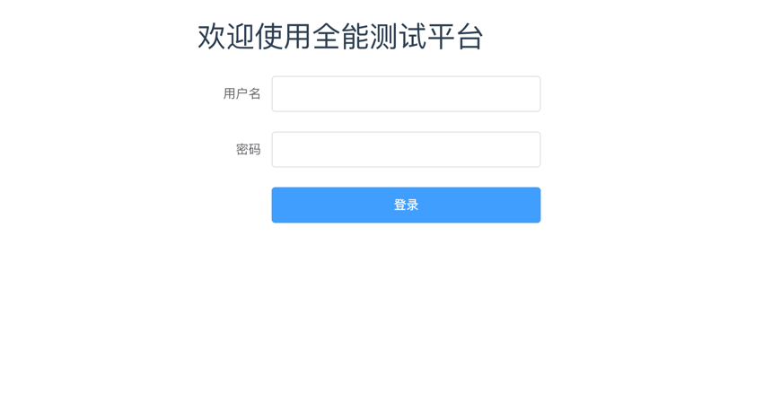
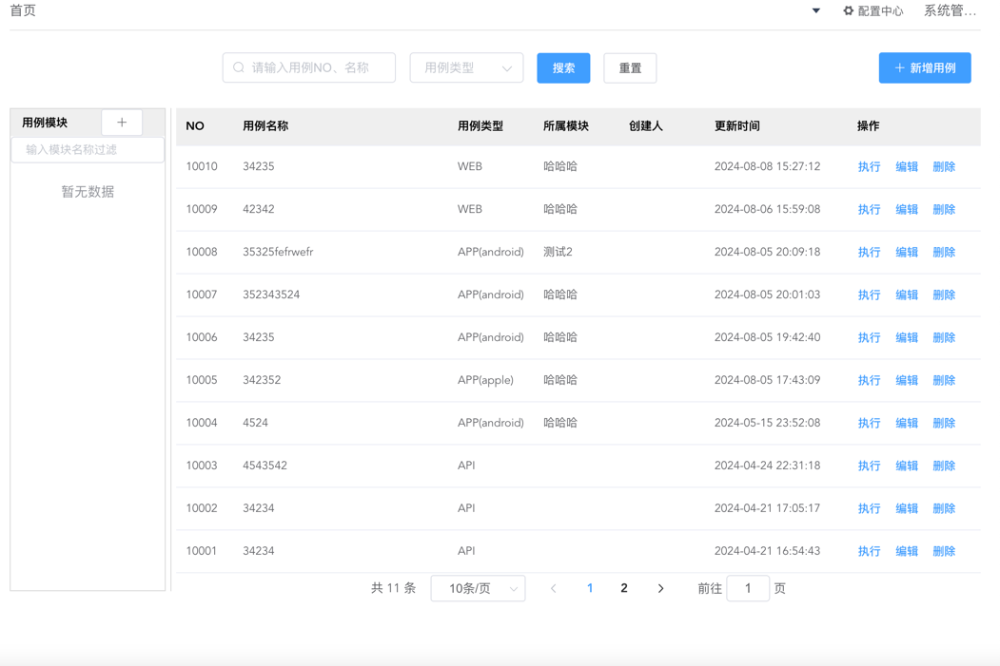

Horizon QA Hub 是全功能测试平台，涵盖软件测试过程中各项测试方式、让测试工作更便捷更高效更易于管理，有效提升测试效率。

- **用例管理**：支持测试用例的创建、编辑、删除、版本管理等功能，让你的测试用例管理更简单；
- **接口测试**：支持 RESTful协议，断言验证、数据提取，让你的接口测试更简单
- **UI测试**：支持元素控件管理、数据驱动、断言验证、测试报告，让你的 UI 测试更简单；
- **性能测试**：提供了高并发的压测，分布式测试，测试脚本修改查看，机器资源的查看；
- **测试报告**：提供了详细的测试报告内容展示，报告管理；

## UI 展示

## 技术栈

-   后端: [Spring Boot](https://www.tutorialspoint.com/spring_boot/spring_boot_introduction.htm)
-   前端: [Vue.js](https://vuejs.org/)
-   中间件: [MySQL](https://www.mysql.com/), [Kafka](https://kafka.apache.org/), [MinIO](https://min.io/), [Redis](https://redis.com/)
-   基础设施: [Docker](https://www.docker.com/)
-   测试引擎: [Python](https://www.python.org/)

## License & Copyright

Copyright (c) 2014-2024 beyond, All rights reserved.

